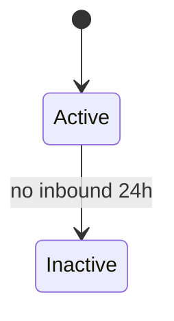

# {Feature Name} — Requirements Spec

> **Status:** draft | in-review | approved  
> **Priority:** P0 (revenue-critical) | P1 | P2  
> **Last verified against code:** YYYY-MM-DD  
> **Code anchors:** `{Controller}`, `{Service}`  
> **Related structural docs:** [feature.md](../codebase/03-methods/feature.md), [data-flow](../codebase/06-data-flow.md)

---

## 1. Purpose

One paragraph: what user problem this feature solves and why it exists.

## 2. Actors & permissions

| Actor | Role(s) | Can do | Cannot do |
|-------|---------|--------|-----------|
| Account owner | `ADMIN` | … | … |
| Agent | `AGENT` | … | … |
| Master | `MASTER` | … | … |
| System | webhook / scheduler | … | — |
| Public API | API key | … | … |

Reference: `FeaturePermissionGuard`, `@PreAuthorize` on controller.

## 3. Scope

### In scope

- …

### Out of scope

- …

## 4. Entry points

| Trigger | Handler | Service chain |
|---------|---------|---------------|
| `GET /path` | `Controller.method` | `Service.method` → … |
| Webhook | … | … |
| `@Scheduled` | … | … |
| SSE event | … | … |

## 5. Business rules

Each rule is **testable**. Use stable IDs (`{FEATURE}-R01`).

### {FEATURE}-R01 — {Short title}

**Priority:** must | should | may  
**Source:** product / Meta API / internal invariant

| Given | When | Then |
|-------|------|------|
| … | … | … |

**Edge cases**

| Given | When | Then |
|-------|------|------|
| … | … | … |

**Implementation:** `ClassName.method` (line ref optional)

---

## 6. State & data

### Entities touched

| Entity | Read | Write | Notes |
|--------|------|-------|-------|
| `conversations` | ✓ | ✓ | … |

### State transitions (if applicable)

### Idempotency & deduplication

| Key | Behavior on duplicate |
|-----|----------------------|
| `meta_message_id` | Skip insert, no error |

## 7. Side effects

| Effect | When | Payload / detail |
|--------|------|------------------|
| SSE `NEW_MESSAGE` | After persist | Full `MessageResponse` snapshot |
| `message_queue` row | Outbound send | … |
| Email | … | … |

## 8. Errors & HTTP mapping

| Condition | HTTP | Exception / message |
|-----------|------|-------------------|
| Missing permission | 403 | `ApiException` … |

## 9. Configuration

| Property | Default | Effect |
|----------|---------|--------|
| `app.feature.enabled` | `true` | … |

## 10. Test matrix

Map each rule ID to test type. **Empty cells = coverage gap.**

| Rule ID | Unit | Integration (TestContainers) | Manual smoke |
|---------|------|-------------------------------|--------------|
| {FEATURE}-R01 | ✓ | ✓ | webhook replay |
| {FEATURE}-R02 | | ✓ | |

### Suggested test class names

| Layer | Class | Rules covered |
|-------|-------|---------------|
| Unit | `{Service}Test` | R01, R02 |
| Integration | `{Controller}IT` | R03 |
| ArchUnit | existing layer rules | — |

## 11. Observability

| Signal | Location | Gap? |
|--------|----------|------|
| Metric | `WebhookMetrics.*` | — |
| Log + MDC | `LoggingMdc` | missing on silent skip |

## 12. Open questions

- [ ] …

## 13. Changelog

| Date | Change | Author |
|------|--------|--------|
| YYYY-MM-DD | Initial spec | … |
